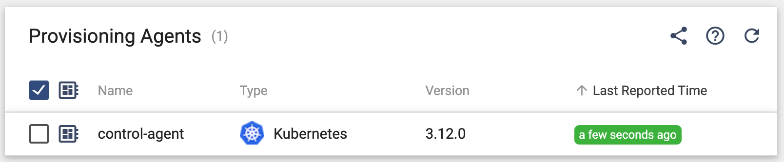

# IMPORTANT NOTE

This project is for use with legacy Control Hub 3.x.  Users of StreamSets Platform now enjoy [top-level Kubernetes deployment support](https://docs.streamsets.com/portal/platform-controlhub/controlhub/UserGuide/Deployments/Kubernetes.html#concept_ec3_cqg_hvb) and should deploy StreamSets' new Kubernetes Agent using the steps [here](https://docs.streamsets.com/portal/platform-controlhub/controlhub/UserGuide/Environments/Kubernetes.html#concept_l1w_h4g_2vb) instead.  It is strongly recommended that users deploying Data Collector on legacy StreamSets Control Hub v3.x upgrade to StreamSets Platform.

## Control Agent install on Kubernetes

This project provides a quick and easy way to deploy a StreamSets [Control Agent](https://streamsets.com/blog/streamsets-control-hub-kubernetes/) on various Kubernetes clusters for legacy StreamSets Control Hub v3.x. 

There are three steps involved:

- Init your environment for your specific k8s provider
- Prepare the install script
- Run the appropriate install script

For all environments, you will need credentials for a Control Hub user with Provisioning Operator Role.

### Prerequisites:
- [jq](https://stedolan.github.io/jq/) must be installed on your local machine.
  You can install jq on MacOS using the command <code>brew install jq</code> 


### If your namespace has resource quotas
If the namespace you are deploying Control Agent into has resource quotas, make sure to include resource requests and limits in your control-agent's manifest.  See the example
[here](https://github.com/onefoursix/control-agent-k8s-deployment/blob/master/yaml/control-agent-with-resource-limits.yaml).

### Environment-Specific Init Steps:

- For AKS execute the init steps [here](https://github.com/onefoursix/control-agent-k8s-deployment/blob/master/aks.md)

- For EKS execute the init steps [here](https://github.com/onefoursix/control-agent-k8s-deployment/blob/master/eks.md)

- For GKE execute the init steps [here](https://github.com/onefoursix/control-agent-k8s-deployment/blob/master/gke.md)


### Instructions for deploying on Control Hub 3.x

#### Prepare the Script for Control Hub 3.x


Set these variables at the top of the file ````deploy-control-agent-on-sch-3.x.sh````:
````
SCH_ORG=<YOUR-SCH-ORG>
SCH_URL=<YOUR-SCH-URL>
SCH_USER=<YOUR-SCH-USER>
SCH_PASSWORD=<YOUR-SCH-PASSWORD>
KUBE_NAMESPACE=<YOUR-K8S-NAMESPACE> # The Namespace will be created if it does not exist
````
For example, in my environment, I set the script's variables like this:

````
SCH_ORG=globex               
SCH_URL=https://sch.onefoursix.com:18631                
SCH_USER=mark@globex              
SCH_PASSWORD=<redacted>          
KUBE_NAMESPACE=ns1 
````

#### Run the script for Control Hub 3.x

Execute the script ````deploy-control-agent-on-sch-3.x.sh````
````
$ ./deploy-control-agent-on-sch-3.x.sh
````


The script output should look something like this:
````
$ ./deploy-control-agent-in-aks.sh
namespace/ns1 created
Context "mark-cluster-1" modified.
secret/control-agent-token created
secret/control-agent-secret created
configmap/control-agent-config created
serviceaccount/streamsets-agent created
role.rbac.authorization.k8s.io/streamsets-agent created
rolebinding.rbac.authorization.k8s.io/streamsets-agent created
deployment.apps/control-agent created
````


### Validate the Control Agent
The Control Agent should register itself with Control Hub like this:




### How to see what the Control Agent is doing

You can tail the log of the Control Agent pod like this:

````
$ kubectl get pods
NAME                            READY   STATUS    RESTARTS   AGE
control-agent-c8888f646-zsfd6   1/1     Running   0          33m

$ kubectl logs -f control-agent-c8888f646-zsfd6
````

You should see a steady stream of messages like this if the Control Agent is healthy:

````
... Getting Events from DPM
... Getting Events from DPM
... Syncing Deployment Status
... Queuing Event Type : 'DEPLOYMENT_STATUS_EVENT_MULTIPLE' with Payload '{"deploymentStatuses":[]}' for DPM
...
````

